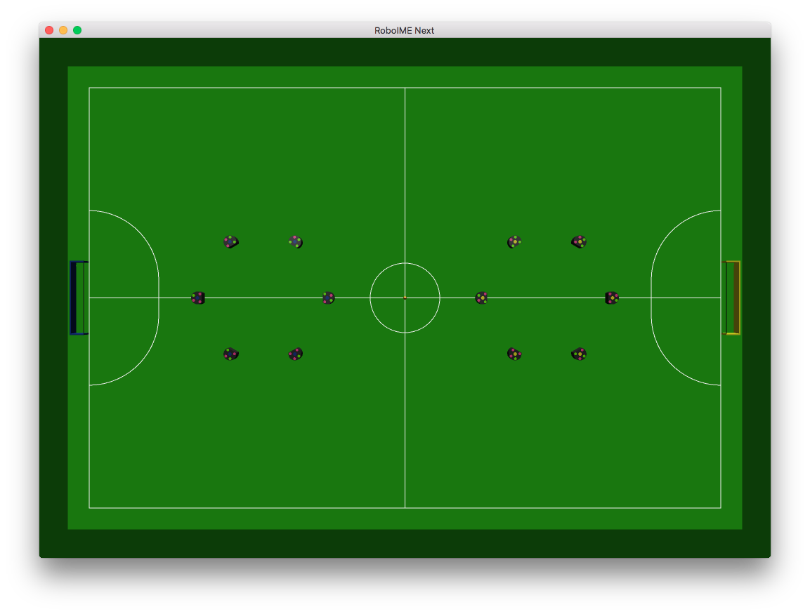

roboime-next
============

Next iteration of [RoboIME][roboime]'s software stack, coded in [Rust][rust].

[][mpl2]

[Documentation][docs]

Developing
----------

Install the project:

    cargo install roboime-next

To run the `demo-ai` bot:

    roboime-next-gui --blue="python demos/python2/demo.py"

This will resolve, download and compile dependencies, and compile the project in debug mode and run it. That's it. Really!

See [the CLI read-me](cli/README.md) for more demos.

> NOTE: in the near future the cli will be installable via cargo, so only `cargo install roboime-next-cli` instead of all of the above.

If you wish to run your own bot you only have to generate an executable that conforms to the protocol described in the Game I/O section,
and call `roboime-next-gui` with it:

    roboime-next-gui --blue="python demos/python2/demo.py"

> NOTE: the `my-awesome-bot` file has to be executable, just make sure it runs without `cargo run` first.

For more settings like sending to a remote __grSim__ or playing as a different color:

    cargo run -- --help

> NOTE: an executable is generated on roboime-next/cli/target/debug/roboime-next-cli[.exe] which can be used directly as well.

### Editor/IDE

Please, setup [EditorConfig](http://editorconfig.org/) on your editor/IDE. Also, when writing code, aim to respect the surrounding style
conventions.  In the future code lints will be added to warn about style that deviates from our preference, for now that's not a priority.

### Optimized builds

    cargo run --release

Game I/O
--------

__Notes:__ linear (`x`, `y`, field measures) units are in meters, angular (`w`) are in radians, linear velocities (`vx`, `vy`) are in
meters per second, and angular velocity in radians per second.

### Initialization input

__Line 1__ version data:

- `"ROBOIME_AI_PROTOCOL"`: literal string;
- `VERSION`: an integer, currently `1`, this is increased when incompatible changes are made.

Before the next line, it will wait for the correct initialization output.

__Line 2__ field data:

- `FIELD_LENGTH`: a float.
- `FIELD_WIDTH`: a float.
- `GOAL_WIDTH`: a float.
- `CENTER_CIRCLE_RADIUS`: a float.
- `DEFENSE RADIUS`: a float.
- `DEFENSE STRETCH`: a float.

### Initialization output

Currently the following line is expected:

- `COMPATIBLE 1`

In the future, the following may be used to state explicit incompatibility:

- `NOT_COMPATIBLE 1`, given that `1` is the highest compatible version

### Input for one game turn

__Line 1__ general play data:

- `COUNTER`: an integrer, counter for the number of received packets
- `TIMESTAMP`: a float, the time elapsed since the play started
- `REFEREE_STATE`: a char, indicates the referee state, one of the following:
  - `S`: __STOP__, stay at least 0.5m away from the ball
  - `N`: __NORMAL__, go wild, score goals
  - `A`: __AVOID__, go wild, score goals, except the indicated robot must not touch the ball
  - `p`: __PRE\_KICKOFF__, return to your field, you will kickoff shortly
  - `k`: __KICKOFF__, you're authorized to kickoff now
  - `i`: __INDIRECT__, kick the ball to resume the game, no double touches or direct goals allowed
  - `d`: __DIRECT__, kick the ball to resume the game, no double touches allowed
  - `x`: __PRE\_PENALTY__, get your robots behind the "penalty line", wait for the order to shoot
  - `y`: __PENALTY__, you may shoot the penalty, and you better score it
  - `P`: __OPPONENT\_PRE_KICKOFF__, return to your field, the opponent will kickoff shortly
  - `K`: __OPPONENT\_KICKOFF__, the opponent is authorized to kickoff, you must still stay away from the ball until the state returns to normal
  - `I`: __OPPONENT\_INDIRECT__, the opponent must kick the ball to resume the play, wait for the normal state to approach the ball
  - `D`: __OPPONENT\_DIRECT__, the opponent must kick the ball to resume the play, wait for the normal state as per above
  - `X`: __OPPONENT\_PRE_PENALTY__, get your robots ready, the opponent will shoot a penalty shortly
  - `Y`: __OPPONENT\_PENALTY__, the opponent may shoot now, save it
- `REFEREE_MORE_INFO`: an integer, when `REFEREE_STATE` is __AVOID__ this will be the id of the robot, for all other cases it's -1
- `SCORE_PLAYER`: an integrer, your team score
- `SCORE_OPPONENT`: an integrer, the opponent team score
- `GOALIE_ID_PLAYER`: an integrer, the id of your goalkeeper (the robot allowed inside the defense area)
- `GOALIE_ID_OPPONENT`: an integrer, the id of the opponent team goalkeeper

__Line 2__ ball status data:

- `BALL_X`: a float, ball x position
- `BALL_Y`: a float, ball y position
- `BALL_VX`: a float, ball x velocity
- `BALL_VY`: a float, ball y velocity

__Next line__:
- `ROBOT_COUNT_PLAYER`: an integrer, number of robots in your team

__Next `ROBOT_COUNT_PLAYER` lines__, robots data:

- `ROBOT_ID`: an integrer, robot identifier
- `ROBOT_X`: a float, robot x position
- `ROBOT_Y`: a float, robot y position
- `ROBOT_W`: a float, robot angular position
- `ROBOT_VX`: a float, robot x velocity
- `ROBOT_VY`: a float, robot y velocity
- `ROBOT_VW`: a float, robot angular velocity

__Next line__:
- `ROBOT_COUNT_OPPONENT`: an integrer, number of robots in the opponent team

__Next `ROBOT_COUNT_OPPONENT` lines__, robots data:

- `ROBOT_ID`: an integrer, robot identifier
- `ROBOT_X`: a float, robot x position
- `ROBOT_Y`: a float, robot y position
- `ROBOT_W`: a float, robot angular position
- `ROBOT_VX`: a float, robot x velocity
- `ROBOT_VY`: a float, robot y velocity
- `ROBOT_VW`: a float, robot angular velocity

### Output for one game turn

__Line 1__, command counter:

- `COUNTER`: an integrer, of counter for the number of sent packages;

__Next `ROBOT_COUNT_PLAYER` lines__, robots commands:

- `V_TANGENT`: a float, robot tangencial velocity
- `V_NORMAL`: a float, robot normal velocity
- `V_ANGULAR`: a float, robot angular velocity
- `KICK_FORCE`: a float, robot kick force (currently this is the shooting velocity)
- `CHIP_FORCE`: a float, robot chip kick force, similar to `KICK_FORCE` but is shot at a 45 degrees angle
- `DRIBBLE`: a bool, true (`1`) if the dribbler will be turned on, else (`0`) it will be off

> NOTE: only one of KICK_FORCE, CHIP_FORCE and DRIBBLE will be in effect at any given moment, in the future
> the protocol may be amended to make this more explicit.

These actions will be applied on the robots in the order they were given.

### Constraints

The robot diameter is always `0.180`, we'll call it `ROBOT_DIAM` here.

- `0 <= COUNTER < 1000000`
- `0 <= OUR_SCORE, OPPONENT_SCORE, <= 10`
- `0 <= ROBOT_ID <= 12`
- `|ROBOT_X|, |BALL_X| <= FIELD_LENGTH / 2 + ROBOT_DIAM`
- `|ROBOT_Y|, |BALL_Y| <= FIELD_WIDTH / 2 + ROBOT_DIAM`
- `|ROBOT_W| <= π`
- `||ROBOT_VX, ROBOT_VY||, ||BALL_VX, BALL_VY|| <= 20.0`
- `|ROBOT_VW| <= 10.0 * π`

GUI
---

There is a __GUI__: `roboime-next-gui`.

Main objectives include:

- 3D visualization of the game state
- Configure child process AIs for both teams
- Simulate the game state, including the referee
- Provide an stderr based API for the AI to draw on top of the game state

### Screenshots

License
-------

This code is licensed under the [Mozilla Public License 2.0][mpl2], of which a textual copy is available at [LICENSE.txt](LICENSE.txt).

You are allowed and encouraged to use this software on the RoboCup competitions.  If you do, please let us know.

Although not required, we think it's best for all if improvements are shared.

[roboime]: http://www.roboime.com/
[rust]: https://www.rust-lang.org/
[mpl2]: https://www.mozilla.org/MPL/2.0/
[docs]: http://www.roboime.com/roboime-next/
