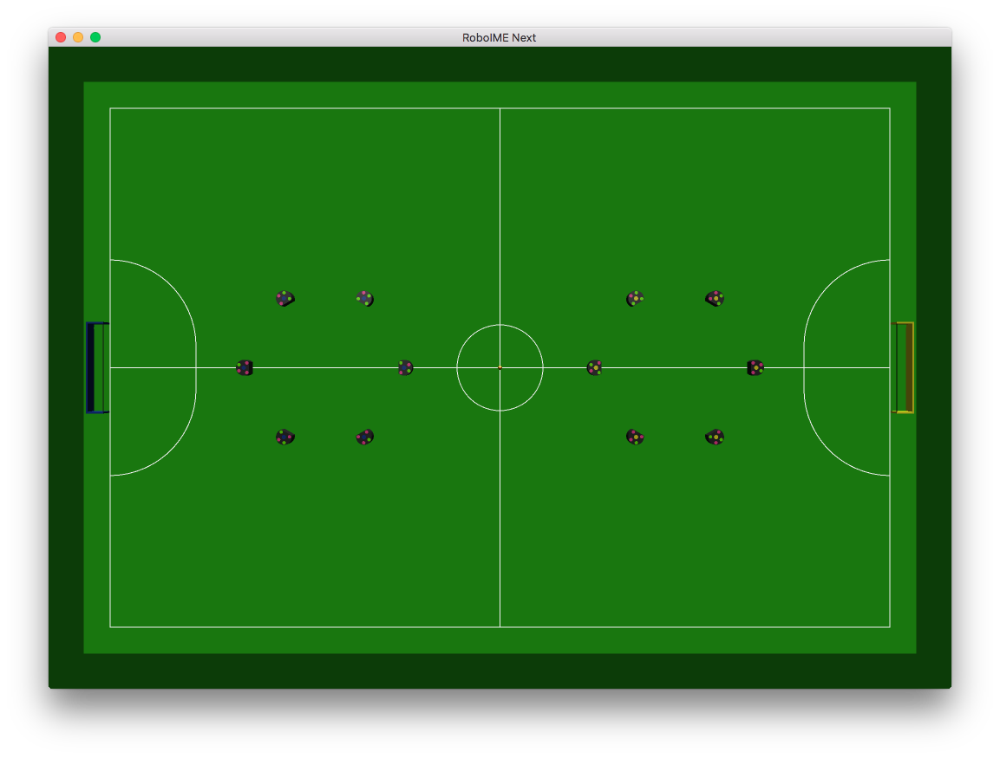

roboime-next-gui
================

WIP implementation of a graphical interface for the core.

Main objectives include:

- 3D visualization of the game state
- Configure child process AIs for both teams
- Simulate the game state, including the referee
- Provide an stderr based API for the AI to draw on top of the game state

### Screenshots

